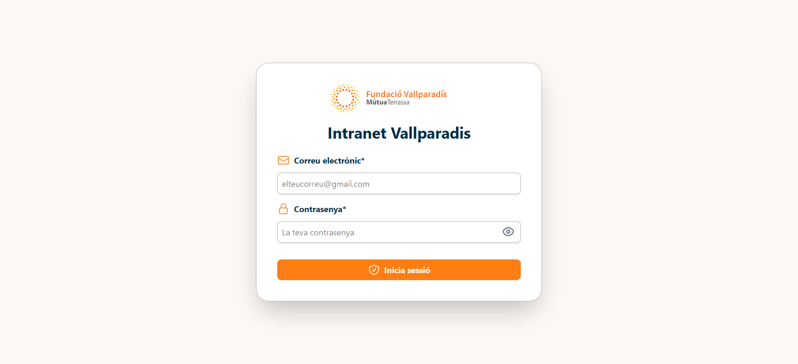
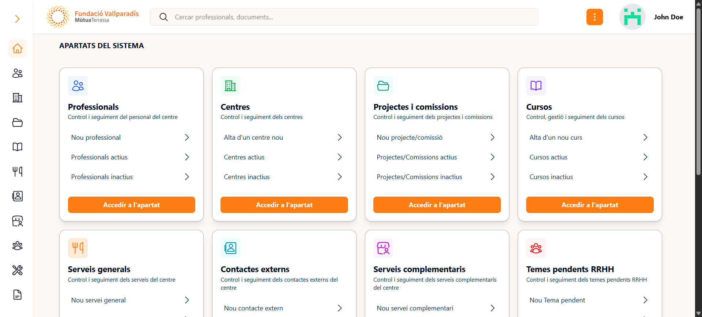
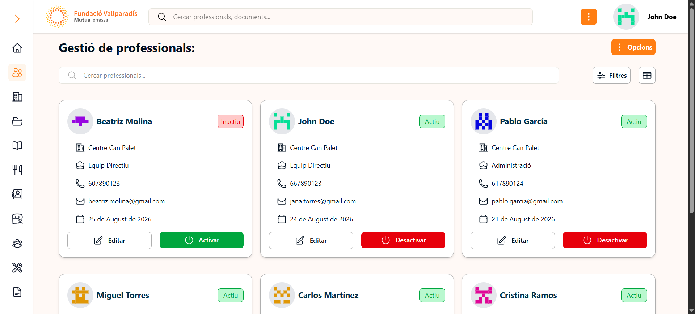
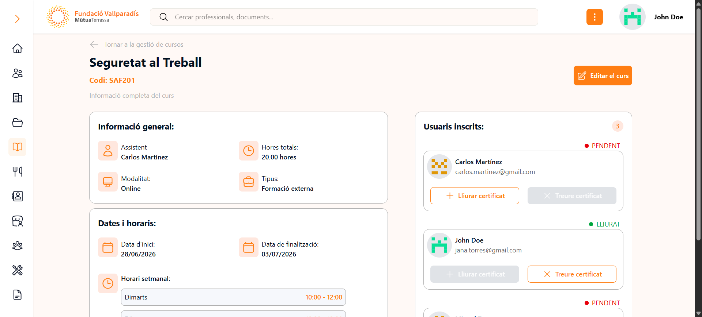

# Intranet Vallparadis

Aplicacion web interna para la gestion operativa y documental de centros Vallparadis. La plataforma centraliza en un unico entorno la administracion de profesionales, cursos, proyectos, documentacion, seguimiento interno y procesos de soporte, facilitando el trabajo coordinado entre distintos centros y perfiles de usuario.

Desarrollada sobre Laravel, la aplicacion combina una base administrativa solida con herramientas orientadas al dia a dia: control de acceso por roles, contexto de centro activo, repositorio documental privado, exportaciones a Excel y una interfaz pensada para consulta y gestion rapida.



## Caracteristicas principales

- Gestion centralizada de profesionales, centros, cursos, proyectos y documentacion.
- Control de acceso segun rol de usuario.
- Contexto de trabajo por centro.
- Seguimiento interno de personal, RRHH y mantenimiento.
- Exportaciones a Excel en distintos modulos.
- Almacenamiento y descarga de documentos privados.
- Interfaz responsive con vistas en formato tarjeta y tabla.

## Funcionalidades destacadas

La aplicacion esta orientada a equipos que necesitan centralizar informacion operativa sin dispersarla entre hojas de calculo, documentos sueltos y canales informales. Entre sus capacidades mas relevantes destacan:

- Gestion de profesionales con informacion operativa, documentos asociados y seguimiento;
- Administracion de cursos con participantes, horarios y control de certificados;
- Repositorio documental estructurado por categorias;
- Seguimiento de incidencias y procesos internos vinculados a RRHH y mantenimiento;
- Exportacion de datos para reporting y gestion administrativa.



## Stack tecnologico

- PHP 8.2
- Laravel 12
- Blade
- Tailwind CSS 4
- Vite 7
- JavaScript
- MySQL

## Instalacion

### Requisitos

- PHP 8.2 o superior
- Composer
- Node.js y npm

### Puesta en marcha

```bash
git clone https://github.com/Ale2484/intranet-vallparadis
cd intranet-vallparadis
composer install
npm install
cp .env.example .env
php artisan key:generate
php artisan migrate --seed
php artisan storage:link
composer run dev
```

Configurar la conexion a MySQL en `.env` antes de ejecutar las migraciones.

## Estructura del proyecto

```text
app/
  Http/Controllers/
  Http/Middleware/
  Models/
  Exports/
resources/
  views/
  js/
  css/
database/
  migrations/
  seeders/
routes/
  web.php
```

## Capturas

La aplicacion combina gestion administrativa y consulta operativa en una interfaz clara, con listados, fichas de detalle y herramientas de seguimiento adaptadas al trabajo interno.



En el area formativa, cada curso concentra la informacion clave en una unica vista: participantes, fechas, horarios y estado de certificacion.



## Licencia

**Propietario - Todos los derechos reservados.**

El codigo fuente se publica unicamente con fines de consulta y referencia.
No se concede permiso para usarlo, copiarlo, modificarlo, distribuirlo ni
incorporarlo en otros proyectos sin autorizacion previa y por escrito del autor.

Para consultas sobre licencias, contacta con nosotros.
